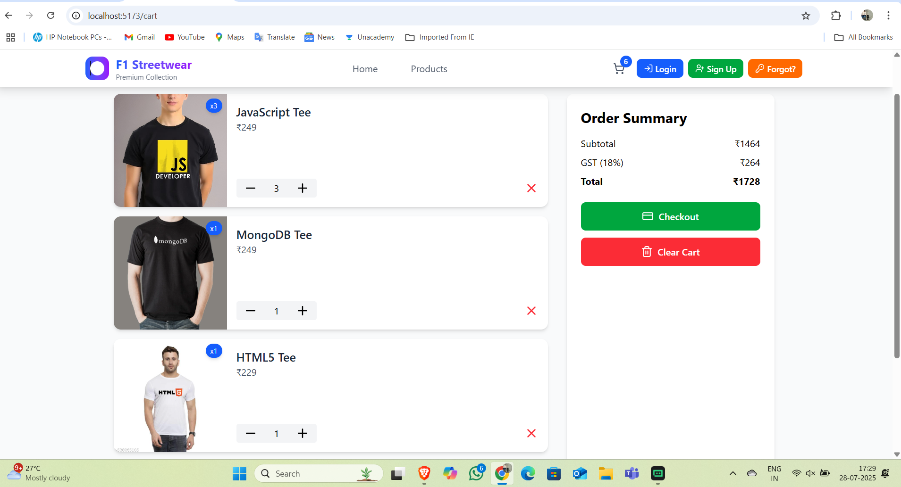
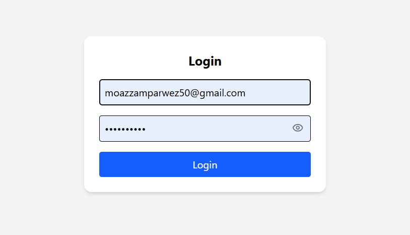

 # 🏁 F1 Streetwear E-commerce

A modern and stylish e-commerce platform inspired by Formula 1 streetwear — built with **React**, **Framer Motion**, **Tailwind CSS**, and **Google App Script** backend.

## 🚀 Live Demo
 

🔗 [View Live Site on Vercel](https://f1-streetwear-framer-e-commerce-md-sahil-khans-projects-70856617.vercel.app)


 

## 📸 Screenshots

| Home Page                             | Product Details                          |
|--------------------------------------|------------------------------------------|
|       |     |

| Cart Page                             | Login Page                            |
|---------------------------------------|------------------------------------------|
|        |   |

| signup page                            | Forget password page                            |
|---------------------------------------|------------------------------------------|
|        |   | 
 

 | Excel shett screenshot                            | 
|   

> 📁 Place all images in a `screenshots/` folder inside your project root before pushing to GitHub.

## 🛠 Features

- 🔐 Login, Signup & Forgot Password (with Google App Script)
- 🛒 Add to Cart, Remove Items, and Clear Cart
- 💳 Checkout with order confirmation
- ⚡ Smooth animations using Framer Motion
- 📱 Fully responsive across devices
- 📦 Order summary with GST & pricing

## 🧑‍💻 Tech Stack

- **Frontend**: React, Tailwind CSS, Framer Motion, React Toastify
- **Backend**: Google Apps Script (Sheet-based API)
- **Icons**: Lucide React
- **Deployment**: Vercel

## 📂 Project Structure

Deployed using Vercel for fast global delivery.

Google Sheets used as a backend via Google Apps Script Web API.
🙏 Acknowledgements

Lucide Icons

Vercel

Framer Motion

## 🧑‍💻 Tech Stack
---

## 🗄️ Backend Integration (Google Apps Script + Sheets)

This project uses **Google Sheets** as a simple backend via **Google Apps Script Web API**:

- ✅ No server required — all logic handled in the cloud.
- ✅ Data stored directly in a Google Sheet.
- ✅ Ideal for lightweight e-commerce MVPs and quick prototypes.

> To use this:
> 1. Open a Google Sheet → Extensions → Apps Script
> 2. Paste backend code
> 3. Deploy as Web App (public)
> 4. Replace the fetch URL in `Cart.jsx`, `Login.jsx`, etc. with your deployed Web App link

## this is my app script code

```javascript
const OTP_EXPIRY_MINUTES = 10;

function doPost(e) {
  const ss = SpreadsheetApp.getActiveSpreadsheet();
  const sheet = ss.getSheetByName("Sheet1") || ss.insertSheet("Sheet1");
  const timestamp = new Date();
  const email = e.parameter.email || '';
  const type = e.parameter.type || 'unknown';

  // Headers if first time
  if (sheet.getLastRow() === 0) {
    sheet.appendRow(["Timestamp", "Type", "Email", "Details 1", "Details 2"]);
  }

  if (type === 'login' || type === 'signup') {
    const password = e.parameter.password || '';
    sheet.appendRow([timestamp, type, email, `Password: ${password}`, ""]);
  }

  else if (type === 'send-otp') {
    const otp = Math.floor(100000 + Math.random() * 900000).toString();

    MailApp.sendEmail({
      to: email,
      subject: "Your OTP for Password Reset",
      htmlBody: `<p>Your OTP is: <b>${otp}</b><br>This will expire in ${OTP_EXPIRY_MINUTES} minutes.</p>`
    });

    // Store OTP in same Sheet1
    sheet.appendRow([timestamp, type, email, `OTP: ${otp}`, ""]);
  }

  else if (type === 'reset-password') {
    const otp = e.parameter.otp || '';
    const newPassword = e.parameter.newPassword || '';
    const now = new Date();

    const rows = sheet.getDataRange().getValues();
    let isValid = false;

    for (let i = rows.length - 1; i >= 0; i--) {
      const [rowTime, rowType, rowEmail, detail1] = rows[i];
      const otpMatch = detail1 && detail1.toString().includes(`OTP: ${otp}`);
      const withinTime = (now - new Date(rowTime)) / (1000 * 60) <= OTP_EXPIRY_MINUTES;

      if (rowType === 'send-otp' && rowEmail === email && otpMatch && withinTime) {
        isValid = true;
        break;
      }
    }

    if (isValid) {
      sheet.appendRow([timestamp, type, email, `OTP Verified`, `New Password: ${newPassword}`]);
      return ContentService.createTextOutput(JSON.stringify({ result: "success" }))
        .setMimeType(ContentService.MimeType.JSON);
    } else {
      return ContentService.createTextOutput(JSON.stringify({ result: "failed", message: "Invalid or expired OTP" }))
        .setMimeType(ContentService.MimeType.JSON);
    }
  }

  else if (type === 'checkout') {
    const cartItems = e.parameter.cartItems || '';
    const total = e.parameter.total || '';
    sheet.appendRow([timestamp, type, email, `Cart: ${cartItems}`, `Total: ₹${total}`]);
  }

  return ContentService
    .createTextOutput(JSON.stringify({ result: "success" }))
    .setMimeType(ContentService.MimeType.JSON);
}

```
## excel link : https://docs.google.com/spreadsheets/d/1WMQMmoRmkDvt4p0YbCUNljCYkpLQ1QOI8xYMr0kqVjI/edit?gid=0#gid=0
## appscript link : https://script.google.com/macros/s/AKfycbzRN_8dlSY5u5ZKqliS17okCuCGF8_cSq2vqPH_uagWHKIQmWYvIdMB2vtHDpsD6eSSYA/exec
  


📫 Feel free to connect with me on Email: [mdsahilkhan2001@gmail.com](mailto:mdsahilkhan2001@gmail.com)
